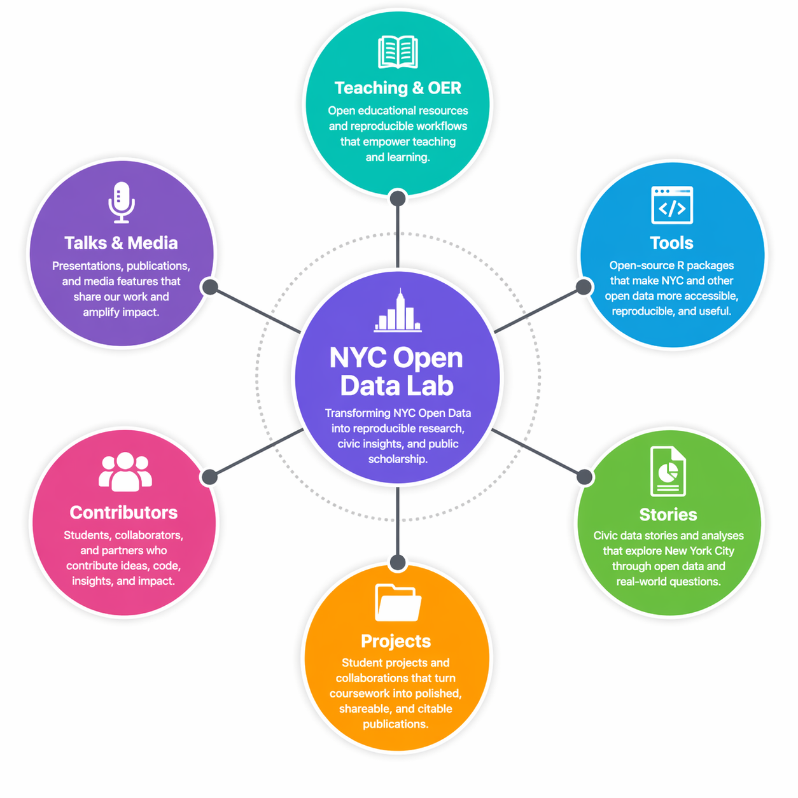

---

---

---
title: "NYC Open Data Lab"
subtitle: "Turning NYC Open Data into reproducible research, public insights, and student-driven publications."
---

The NYC Open Data Lab is a public-facing initiative focused on transforming New York City’s open data into reproducible research, civic insights, and accessible public scholarship.

Built at the intersection of data science, education, and storytelling, the Lab brings together student research, open-source tools, and real-world analyses using data from the NYC Open Data Portal. Our work emphasizes reproducibility, transparency, and public impact—ensuring that data-driven work doesn’t end in the classroom, but continues to live, evolve, and contribute to conversations about the city.

{fig-alt="A connected ecosystem linking teaching, tools, and public-facing research."}

------------------------------------------------------------------------

## What you'll find here

-   **Publish Civic Data Stories** — through NYC Open Data Stories, a living collection of analyses exploring New York City through public datasets
-   **Develop Open-Source Tools** — including R packages designed to make NYC and other open data more accessible and reproducible
-   **Build Public-Facing Student Research** — transforming coursework into polished, shareable, and citable work
-   **Teach Reproducible Workflows** — using R and Quarto to create end-to-end research pipelines
-   **Present & Contribute Publicly** — through conferences, publications, and civic data events

------------------------------------------------------------------------

## Why This Exists

Too often, data work—especially student work—is temporary. It lives in assignments, disappears after grading, and never reaches a broader audience.

*The NYC Open Data Lab exists to change that.*

By designing courses and workflows around reproducibility and public output, the Lab creates a system where work is not only completed, but published, shared, and built upon. The result is a growing ecosystem of civic data research that is open, accessible, and continuously expanding.

------------------------------------------------------------------------

## Explore the Lab

-   Start with [Stories](stories.qmd) to see NYC data brought to life through analysis and visualization
-   Visit [Projects](projects.qmd) to explore the broader ecosystem of work
-   Check out [Tools](tools.qmd) for open-source packages supporting reproducible data access
-   Learn more in [Teaching & OER](teaching-oer.qmd) about the methodology behind the Lab

Start by exploring the [Stories](stories.qmd), or learn more about the Lab’s tools and teaching approach.
