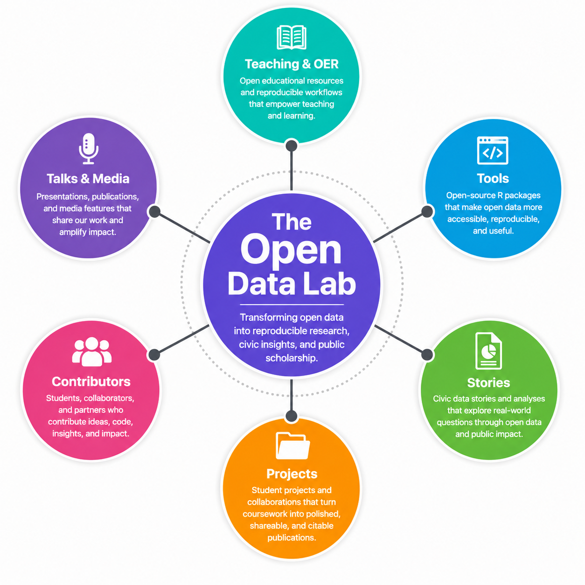

The Open Data Lab is a public-facing research and development initiative focused on making open data more accessible, reproducible, and useful.

Built at the intersection of data science, education, open-source software, and public scholarship, the Lab brings together students, researchers, and collaborators to build tools, conduct research, and create resources using public data. Our work emphasizes reproducibility, transparency, and real-world impact—creating projects that can live beyond the classroom and contribute to broader research, civic, and professional communities.

{fig-alt="A connected ecosystem linking teaching, tools, and public-facing research."}

------------------------------------------------------------------------

## What We Do

- **Develop Open-Source Software** — building R packages and other tools that make public data easier to access, analyze, and use
- **Conduct Applied Research** — using public data to investigate real-world questions and create useful analytical resources
- **Build Public-Facing Student Research** — transforming student work into polished, shareable, and citable scholarship
- **Create Open Educational Resources** — developing textbooks, guides, and reproducible workflows using R and Quarto
- **Create Opportunities for Students** — providing pathways to contribute to software, research, analytics, and other meaningful Lab projects
- **Share Our Work Publicly** — through conferences, publications, open-source communities, and public events

------------------------------------------------------------------------

## Why This Exists

Too often, data work—especially student work—is temporary. It lives in assignments, disappears after grading, or remains inaccessible to the people who could learn from it or build upon it.

*The Open Data Lab exists to change that.*

By connecting open data, reproducible research, open-source development, and education, the Lab creates an ecosystem where work can be published, shared, reused, and expanded. Students gain opportunities to build meaningful work and contribute to real projects, while researchers, educators, practitioners, and the public gain access to tools and resources designed to make public data more useful.

------------------------------------------------------------------------

## Explore the Lab

- Explore [Stories](stories.qmd) to see data brought to life through analysis and visualization
- Discover [Projects & Research](projects.qmd) to explore the Lab's research, educational resources, software, and current initiatives
- Meet the [People](contributors.qmd) behind the work and learn how you can get involved